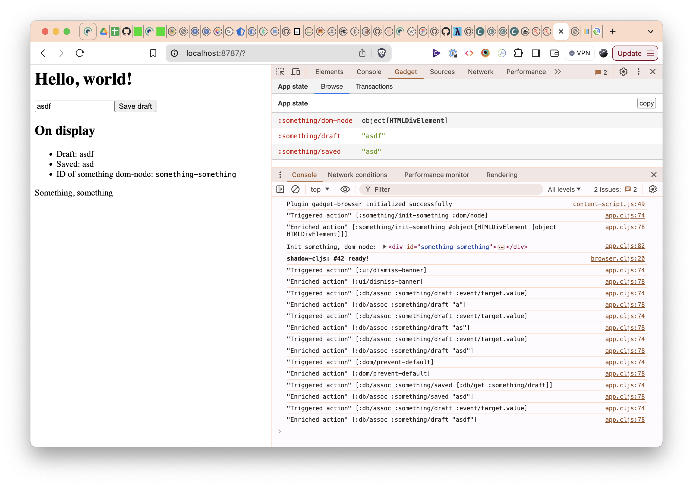

# replicant-mini-app

A tiny example of a [Replicant](https://github.com/cjohansen/replicant) app.

This is an example of how to wire up a Replicant app, with a focus on keeping the views as pure data. We can do this because replicant supports pure data dom event handlers and vdom lifecycle hooks. 

**Replicant**: A native [ClojureScript](https://clojurescript.org) virtual DOM renderer - render hiccup directly

To understand a bit of where Replicant (and this app example) comes from, please watch Christian Johansen's talk at JavaZone 2023, [Stateless, Data-driven UIs](https://2023.javazone.no/program/85f23370-440f-42b5-bf50-4cb811fef44d).

## Running the app

Prerequisites:

- [Node.js](https://nodejs.org) (or something node-ish enough)
- [Java](https://adoptopenjdk.net)
- [Clojure CLI](https://clojure.org/guides/getting_started)

We're using [shadow-cljs](https://github.com/thheller/shadow-cljs) to build the app. Clojure editors like [Calva](https://calva.io) and [CIDER](https://cider.mx/) will let you quickly start the app and connect you to its REPL. You can also just run it without installing anything, by using npx:

```sh
npx shadow-cljs watch :app  
```

Once built, you can access the app at http://localhost:8787

## Reading the code

All the code is in [src/mini/app.cljs](src/mini/app.cljs). It is void of any comments, to make it easier to navigate. Here is some context to get you started:

The app uses vectors for the event and lifecycle hook handlers. Each _event_/_hook_ vector holds zero or more _actions_, which also are vectors. The _actions_ will be executed in the order they appear in the _event_/_hook_ vector. The first element of an _action_ vector is the action name, and the rest of the elements are the arguments to the action. Here's the `event-handler` function where we dispatch on the action names:

```clojure
(defn- event-handler [{:replicant/keys [^js js-event] :as replicant-data} actions]
  (doseq [action actions]
    (prn "Triggered action" action)
    (let [enriched-action (->> action
                               (enrich-action-from-event replicant-data)
                               (enrich-action-from-state @!state))
          [action-name & args] enriched-action]
      (prn "Enriched action" enriched-action)
      (case action-name
        :dom/prevent-default (.preventDefault js-event)
        :db/assoc (apply swap! !state assoc (rest enriched-action))
        :db/dissoc (apply swap! !state dissoc args)
        :dom/set-input-text (set! (.-value (first args)) (second args))
        :dom/focus-element (.focus (first args))
        (prn "Unknown action" action))))
  (render! @!state))
```

See the [Replicant README](https://github.com/cjohansen/replicant?tab=readme-ov-file#replicantdomset-dispatch-f) on what data is available in the `replicant-data` argument of the event handler. This handler only uses `:replicant/js-event`, and `:replicant/node` (in `enrich-action-from-event`).

Here's a stripped-down version of the `edit-view` function from the app:

```clojure
(defn- edit-view []
  [:form {:on {:submit [[:dom/prevent-default]
                        [:db/assoc :something/saved [:db/get :something/draft]]]}}
   [:input#draft {:on {:input [[:db/assoc :something/draft :event/target.value]]}}]
   [:button {:type :submit} "Save draft"]])
```

> Note that there is nothing effectful going on here, nothing is written to any database, the DOM is not manipulated or inspected. That's all taken care of by Replicant and our event handler.

Typing in the `input` element, will fire an event with one action:

1.  `[:db/assoc :something/draft :event/target.value]`

The event handler has access to a reference to the atom we use to store the state of the app. You can probably guess what the action does. But of course we are not `assoc`iating `:event/target.value` into the database. The event handler will first replace it with the actual value of the input field. We can do this because Replicant will provide the event handler with some data of the event, includingthe DOM event object. We refer to this replacing as _enriching_ the action. See the `enrich-action-from-event` function.

Enrichment also involves replacing certain forms in the actions with data from the database (using the `enrich-action-from-state` function). This is in play when submitting the form, which will fire an event of two actions:

1. `[:dom/prevent-default]`
2. `[:db/assoc :something/saved [:db/get :something/draft]]`

The first action will be replaced with a `(.preventDefault js-event)` call . It's the _second_ action that has the state enrichment. The form `[:db/get :something/draft]` will be replaced with the value of the database at the key `:something/draft`.

We can take a look at the console log of this example run:



In the log we can find the result of:

1. Typing "a" in the input field
   ```
   "Triggered action" [:db/assoc :something/draft :event/target.value]
   "Enriched action" [:db/assoc :something/draft "a"]
   ```
2. Submitting the form 
   ```
   "Triggered action" [:dom/prevent-default]
   "Enriched action" [:dom/prevent-default]
   "Triggered action" [:db/assoc :something/saved [:db/get :something/draft]]
   "Enriched action" [:db/assoc :something/saved "a"]
   ```
 
 ### Insisting on data only views
 
 The actual edit view code looks like so:
 
 ```clojure
 (defn- edit-view [{:something/keys [draft]}]
  [:div
   [:h2 "Edit"]
   [:form {:on {:submit [[:dom/prevent-default]
                         [:db/assoc :something/saved [:db/get :something/draft]]]}}
    [:span.wrap-input
     [:input#draft {:replicant/on-mount [[:db/assoc :something/draft-input-element :dom/node]]
                    :on {:input [[:db/assoc :something/draft :event/target.value]]}}]
     (when-not (string/blank? draft)
       [:span.icon-right {:on {:click [[:db/assoc :something/draft ""]
                                       [:dom/set-input-text [:db/get :something/draft-input-element] ""]
                                       [:dom/focus-element [:db/get :something/draft-input-element]]]}
                          :title "Clear draft"}
        "⨉"])]
    [:button {:type :submit} "Save draft"]]])
 ```
 
What's new here is the clear button that appears only when there is data. When clicked, it clears both the draft (in the app db) and the input field (in the DOM). It also focuses the input field (in the DOM). The DOM work could be achieved with functions quering and setting state directly on the DOM. But we want it to be pure data in the view! 

So we have added a life-cycle hook that will fire an action that saves the element to the app db when the input field mounts. Then, when the clear icon is clicked, we will fire actions that will do the quering and setting of the DOM state. These actions picks up the element from the app db.
 
## It's just an example

The `actions` semantics used in this example can be replaced by anything. Maybe you want to use maps, or whatever. Replicant is a library and not a framework. The library facilitates, but does not mandate, pure data oriented views. You can use regular functions in the event handlers if you like. If you want to stay in data land, feel invited to be inspired by the small framework we set up in this example app. At Anteo we use something similar in our production apps, with different adaptations to suit the specific needs of each app.

### Some ideas for adaptations

Keeping the example app mini and to the point, we've left quite a bit of room for adaptations. Here are some ideas we use in our apps:

#### core.match those actions

We find that [core.match](https://github.com/clojure/core.match) is exceptionally well suited for implementing action handlers. If we use that instead of the `case` in the `event-handler` function, it looks like so:

```clojure
      (match enriched-action
        [:dom/prevent-default] (.preventDefault js-event)
        [:db/assoc & args] (apply swap! !state assoc args)
        [:db/dissoc & args] (apply swap! !state dissoc args)
        [:dom/set-input-text element text] (set! (.-value element) text)
        [:dom/focus-element element] (.focus element))
```

Which makes it much easier for a human to parse the action vectors being matched.

#### Split on action namespace

If your app has a lot of action handlers, you may want to split them into separate namespaces. You can use the central `event-handler` function to dispatch based on the namespace of the action identifier.

#### re-frame style event handlers

[re-frame](https://github.com/day8/re-frame) separates the handlers into events and effects. You can do the same, separating on actions and effects, by making your action handlers non-effectful. E.g. return a map with any new state and any effects to be executed. Then take care of the state updates outside the action handlers and add an effect handler for dealing with everything effectful. This makes your action handlers easier to reason about and to test. It also makes it straightforward to adapt many re-frame effect handlers out there to work with your Replicant app.

#### Inject the state

The example uses the global state atom directly. You may want to create the event handler via a function and provide the state to its closure. 

#### Validate the actions

You can make the `event-handler` function detect that you are running in development mode and use Malli to validate the actions (and effects if you go re-frame style). An event driven app can get a bit hard to debug, and getting early warning about non-conforming actions can save the day.

## Keeping the database flat

We think it's worth considering Christian Johansen's advice to try [keep the data as flat as possible](https://chatgpt.com/share/f225e622-44a2-4461-8525-b31f80909d50) (translated from the [original article in Norwegian](https://parenteser.mattilsynet.io/flate-data/)). In this silly app we can keep the databas fully flat, but in a real app you probably also will want actions like `:db/assoc-in`, and `:db/dissoc-in` (and `:db/update-in`).

## Pure data CSS transitions

The app also sports an example of how to use Replicant's pure data CSS transitions (that's the annoying banner when the app starts).

## Gadget inspector

[Christian Johansen](https://github.com/cjohansen), who created Replicant, also created a data inspector that can be used for any ClojureScript app that uses an atom for its state. It is a Chrome Extension, called [gadget-inspector](https://github.com/cjohansen/gadget-inspector).

Yes, the example app uses the Gadget inspector, but to benefit from it you'll need to first build the inspector Extension and install it in your browser. There's a Babashka task included in the repo that will let you build the extension like so:

```sh
bb dev:build-inspector-extension
```

(Assuming you have [Babashka](https://babashka.org/) installed.)

## Dumdom

Does the code look very similar to that of a [Dumdom](https://github.com/cjohansen/dumdom) app? That's because Christian created Dumdom, and Replicant is his next iteration where he got rid of the dependency on [Snabbdom](https://github.com/snabbdom/snabbdom) and the API compatability with [Quiescent](https://github.com/levand/quiescent/), including **Components**. (Replicant views are just regular functions returning hiccup.)

## Licence

Public Domain, **Unlicense**. See [LICENSE.md](LICENSE.md).

## Happy coding! ♥️

Please file issues if you have any questions or suggestions. Pull requests are also welcome (but please file an issue first if your PR would be beyond things like fixing typos). 🙏
